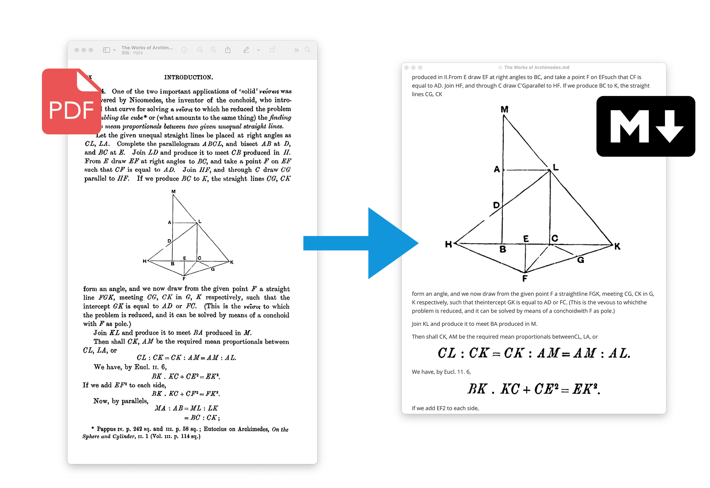
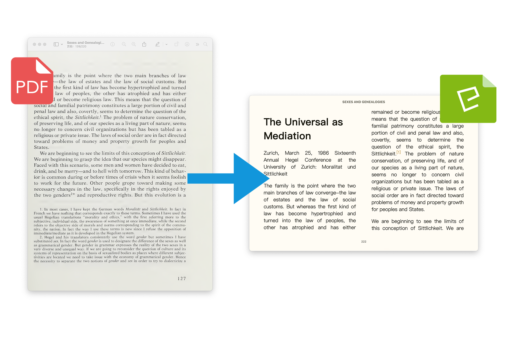
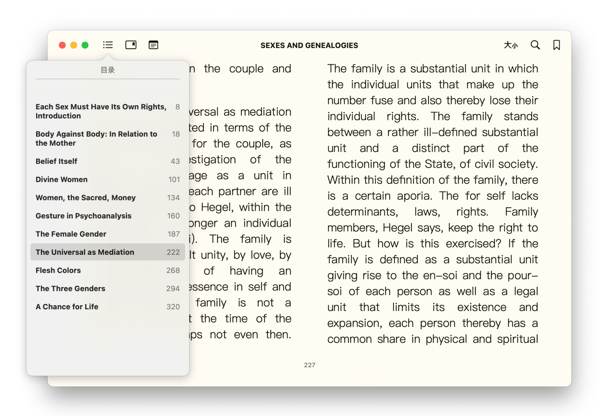
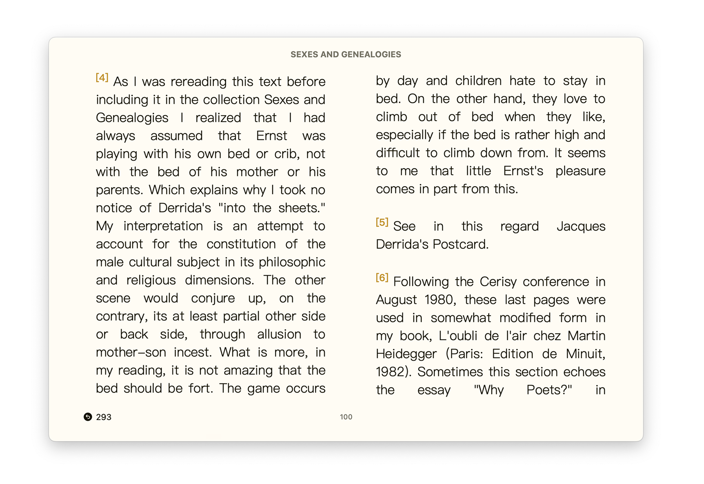

<div align=center>
  <h1>PDF Craft</h1>
  <p>
    <a href="https://github.com/oomol-lab/pdf-craft/actions/workflows/build.yml" target="_blank"></a>
    <a href="https://pypi.org/project/pdf-craft/" target="_blank"></a>
    <a href="https://pypi.org/project/pdf-craft/" target="_blank"></a>
    <a href="https://pypi.org/project/pdf-craft/" target="_blank"></a>
    <a href="https://github.com/oomol-lab/pdf-craft/blob/main/LICENSE" target="_blank"></a>
  </p>
  <p><a href="https://hub.oomol.com/package/pdf-craft-starter?open=true" target="_blank"></a></p>
  <p>English | <a href="./README_zh-CN.md">中文</a></p>
</div>


## Introduction

PDF Craft can convert PDF files into various other formats. This project will focus on processing PDF files of scanned books. If you encounter any problems or have any suggestions, please submit [issues](https://github.com/oomol-lab/pdf-craft/issues).

[](https://www.youtube.com/watch?v=EpaLC71gPpM)

This project can read PDF pages one by one, and use [DocLayout-YOLO](https://github.com/opendatalab/DocLayout-YOLO) mixed with an algorithm I wrote to extract the text from the book pages and filter out elements such as headers, footers, footnotes, and page numbers. In the process of crossing pages, the algorithm will be used to properly handle the problem of the connection between the previous and next pages, and finally generate semantically coherent text. The book pages will use [OnnxOCR](https://github.com/jingsongliujing/OnnxOCR) for text recognition. And use [layoutreader](https://github.com/ppaanngggg/layoutreader) to determine the reading order that conforms to human habits.

With only these AI models that can be executed locally (using local graphics devices to accelerate), PDF files can be converted to Markdown format. This is suitable for papers or small books.

However, if you want to parse books (generally more than 100 pages), it is recommended to convert them to [EPUB](https://en.wikipedia.org/wiki/EPUB) format files. During the conversion process, this library will pass the data recognized by the local OCR to [LLM](https://en.wikipedia.org/wiki/Large_language_model), and build the structure of the book through specific information (such as the table of contents, etc.), and finally generate an EPUB file with a table of contents and chapters. During this parsing and building process, the comments and reference information of each page will be read through LLM, and then presented in a new format in the EPUB file. In addition, LLM can correct OCR errors to a certain extent. This step cannot be performed entirely locally. You need to configure the LLM service. It is recommended to use [DeepSeek](https://www.deepseek.com/). The prompt of this library is based on the V3 model debugging.

## Installation

You need python 3.10 or above (recommended 3.10.16).

```shell
pip install pdf-craft
```

```shell
pip install onnxruntime==1.21.0
```

## Using CUDA

If you want to use GPU acceleration, you need to ensure that your device is ready for the CUDA environment. Please refer to the introduction of [PyTorch](https://pytorch.org/get-started/locally/) and select the appropriate command installation according to your operating system installation.

In addition, replace the command to install `onnxruntime` in the previous article with the following:

```shell
pip install onnxruntime-gpu==1.21.0
```

## Function

### Convert PDF to MarkDown

This operation does not require calling a remote LLM, and can be completed with local computing power (CPU or graphics card). The required model will be downloaded online when it is called for the first time. When encountering illustrations, tables, and formulas in the document, screenshots will be directly inserted into the MarkDown file.

```python
from pdf_craft import PDFPageExtractor, MarkDownWriter

extractor = PDFPageExtractor(
  device="cpu", # If you want to use CUDA, please change to device="cuda" format.
  model_dir_path="/path/to/model/dir/path", # The folder address where the AI ​​model is downloaded and installed
)
with MarkDownWriter(markdown_path, "images", "utf-8") as md:
  for block in extractor.extract(pdf="/path/to/pdf/file"):
    md.write(block)
```

After the execution is completed, a `*.md` file will be generated at the specified path. If there are illustrations (or tables, formulas) in the original PDF, an `assets` directory will be created at the same level as `*.md` to save the images. The images in the `assets` directory will be referenced in the MarkDown file in the form of relative addresses.

The conversion effect is as follows.



### Convert PDF to EPUB

The first half of this operation is the same as Convert PDF to MarkDown (see the previous section). OCR will be used to scan and recognize text from PDF. Therefore, you also need to build a `PDFPageExtractor` object first.

```python
from pdf_craft import PDFPageExtractor

extractor = PDFPageExtractor(
  device="cpu", # If you want to use CUDA, please change to device="cuda" format.
  model_dir_path="/path/to/model/dir/path", # The folder address where the AI ​​model is downloaded and installed
)
```

After that, you need to configure the `LLM` object. It is recommended to use [DeepSeek](https://www.deepseek.com/). The prompt of this library is based on V3 model testing.

```python
from pdf_craft import LLM

llm = LLM(
  key="sk-XXXXX", # key provided by LLM vendor
  url="https://api.deepseek.com", # URL provided by LLM vendor
  model="deepseek-chat", # model provided by LLM vendor
  token_encoding="o200k_base", # local model name for tokens estimation (not related to LLM, if you don't care, keep "o200k_base")
)
```

After the above two objects are prepared, you can start scanning and analyzing PDF books.

```python
from pdf_craft import analyse

analyse(
  llm=llm, # LLM configuration prepared in the previous step
  pdf_page_extractor=pdf_page_extractor, # PDFPageExtractor object prepared in the previous step
  pdf_path="/path/to/pdf/file", # PDF file path
  analysing_dir_path="/path/to/analysing/dir", # analysing directory path
  output_dir_path="/path/to/output/files", # The analysis results will be written to this directory
)
```

Note the two directory paths in the above code. One is `output_dir_path`, which indicates the folder where the scan and analysis results (there will be multiple files) should be saved. The paths should point to an empty directory. If it does not exist, a directory will be created automatically.

The second is `analysing_dir_path`, which is used to store the intermediate status during the analysis process. After successful scanning and analysis, this directory and its files will become useless (you can delete them with code). The path should point to a directory. If it does not exist, a directory will be created automatically. This directory (and its files) can save the analysis progress. If an analysis is interrupted due to an accident, you can configure `analysing_dir_path` to the analysing folder generated by the last interruption, so as to resume and continue the analysis from the last interruption point. In particular, if you want to start a new task, please manually delete or empty the `analysing_dir_path` directory to avoid accidentally triggering the interruption recovery function.

After the analysis is completed, pass the `output_dir_path` to the following code as a parameter to finally generate the EPUB file.

```python
from pdf_craft import generate_epub_file

generate_epub_file(
  from_dir_path=output_dir_path, # from the folder generated by the previous step
  epub_file_path="/path/to/output/epub", # generated EPUB file save path
)
```

This step will divide the chapters in the EPUB according to the previously analyzed book structure and match the appropriate directory structure. In addition, the original annotations and citations at the bottom of the book page will be presented in the EPUB in an appropriate way.





## Advanced Functions

### Multiple OCR

Improve recognition quality by performing multiple OCRs on the same page to avoid the problem of blurred text and missing text.

```python
from pdf_craft import OCRLevel, PDFPageExtractor

extractor = PDFPageExtractor(
  device="cpu",
  model_dir_path="/path/to/model/dir/path",
  ocr_level=OCRLevel.OncePerLayout,
)
```

### Identify formulas and tables

When the constructed `PDFPageExtractor` recognizes a file, by default it will directly crop the formulas and tables in the original page and treat them as images. You can add configuration when constructing it to change the default behavior so that it can extract formulas and tables.

Configuring the value of the `extract_formula` parameter to `True` will enable [LaTeX-OCR](https://github.com/lukas-blecher/LaTeX-OCR) to recognize the formulas in the original page and store them in the form of [LaTeX](https://zh.wikipedia.org/zh-hans/LaTeX).

Configuring the parameters of `extract_table_format` and specifying the format will start [StructEqTable](https://github.com/Alpha-Innovator/StructEqTable-Deploy) to process the table in the original page and store it in the specified format. **Note: This feature requires the local device to support CUDA (and configure the `device="cuda"` parameter)**, otherwise the feature will fall back to the default behavior.

#### Application in Markdown conversion

Insert the two parameters mentioned above when building `PDFPageExtractor` to enable formula and table recognition when converting Markdown.

```python
from pdf_craft import PDFPageExtractor, ExtractedTableFormat

extractor = PDFPageExtractor(
  ..., # Other parameters
  extract_formula=True, # Enable formula recognition
  extract_table_format=ExtractedTableFormat.MARKDOWN, # Enable table recognition (save in MarkDown format)
)
```

In particular, for the Markdown conversion scenario, `extract_table_format` can only be set to `ExtractedTableFormat.MARKDOWN`.

#### Application in EPub conversion

As mentioned in the previous section, you need to insert the two parameters when building. But please note that the value of `extract_table_format` should be `ExtractedTableFormat.HTML`.

```python
from pdf_craft import PDFPageExtractor, ExtractedTableFormat

extractor = PDFPageExtractor(
  ..., # Other parameters
  extract_formula=True, # Enable formula recognition
  extract_table_format=ExtractedTableFormat.HTML, # Enable table recognition (save in MarkDown format)
)
```

In addition, when calling the `generate_epub_file()` function next, you also need to configure `table_render` and `latex_render` to specify how the recognized tables and formulas are rendered in the EPub file.

```python
from pdf_craft import generate_epub_file, TableRender, LaTeXRender

generate_epub_file(
  ..., # other parameters
  table_render=TableRender.HTML, # table rendering mode
  latex_render=LaTeXRender.SVG, # formula rendering mode
)
```

For table rendering mode (`TableRender`), there are only two modes: `HTML` and `CLIPPING`. The former means rendering in HTML form (i.e., `<table>` related tags), and the latter is the default rendering mode, i.e., taking a screenshot from the original page.

For formula rendering mode (`LaTeXRender`), there are three modes: `MATHML`, `SVG`, and `CLIPPING`. Among them, `CLIPPING` is the default behavior, i.e., taking a screenshot from the original page. I will introduce the first two modes separately.

`MATHML` means rendering in EPub files with [MathML](https://en.wikipedia.org/wiki/MathML) tags, which is a mathematical markup language for XML applications. But please note that this language is not supported in EPub 2.0. This means that if this rendering method is used, not all EPub readers can render the formula correctly.

`SVG` means rendering the recognized formula in the form of [SVG](https://en.wikipedia.org/wiki/SVG) files. This is a lossless image format, which means that formulas rendered in this way can be displayed correctly in any reader that supports EPub 2.0. However, this configuration requires `latex` to be installed locally. If it is not installed, an error will be reported during operation. You can use the following command to test whether the local device is correctly installed.

```shell
latex --version
```

### Temperature and top p

As mentioned above, the construction of `LLM` can add more parameters to it to achieve richer functions. To achieve disconnection and reconnection, or specify a specific timeout.

```python
llm = LLM(
  ..., # other parameters
  top_p=0.8, # Nucleus Sampling (optional)
  temperature=0.3, # Temperature (optional)
)
```

In addition, `top_p` and `temperature` can be set to a range. In general, their values ​​will be the leftmost value in the range. Once LLM returns a broken content, the value will gradually move to the right when retrying (not exceeding the right boundary of the range). This prevents LLM from falling into a loop that always returns broken content.

```python
llm = LLM(
  ..., # other parameters
  top_p=(0.3, 1.0) # Nucleus Sampling（optional）
  temperature=(0.3, 1.0), # Temperature (optional)
)
```

### Analysis Request Splitting

When calling the `analyse` method, configure the `window_tokens` field to modify the maximum number of tokens submitted for each LLM request. The smaller this value is, the more requests will be made to LLM during the analysis process, but the less data LLM will process at a time. Generally speaking, the less data LLM processes, the better the effect will be, but the more total tokens will be consumed. Adjust this field to find a balance between quality and cost.

```python
from pdf_craft import analyse

analyse(
  ..., # other parameters
  window_tokens=2000, # Maximum number of tokens in the request window
)
```

You can also set a specific token limit by constructing `LLMWindowTokens`.

```python
from pdf_craft import analyse, LLMWindowTokens

analyse(
  ..., # other parameters
  window_tokens=LLMWindowTokens(
    max_request_data_tokens=4096,
    max_verify_paragraph_tokens=512,
    max_verify_paragraphs_count=8,
  ),
)
```

## Acknowledgements

- [doc-page-extractor](https://github.com/Moskize91/doc-page-extractor)
- [DocLayout-YOLO](https://github.com/opendatalab/DocLayout-YOLO)
- [OnnxOCR](https://github.com/jingsongliujing/OnnxOCR)
- [layoutreader](https://github.com/ppaanngggg/layoutreader)
- [StructEqTable](https://github.com/Alpha-Innovator/StructEqTable-Deploy)
- [LaTeX-OCR](https://github.com/lukas-blecher/LaTeX-OCR)
