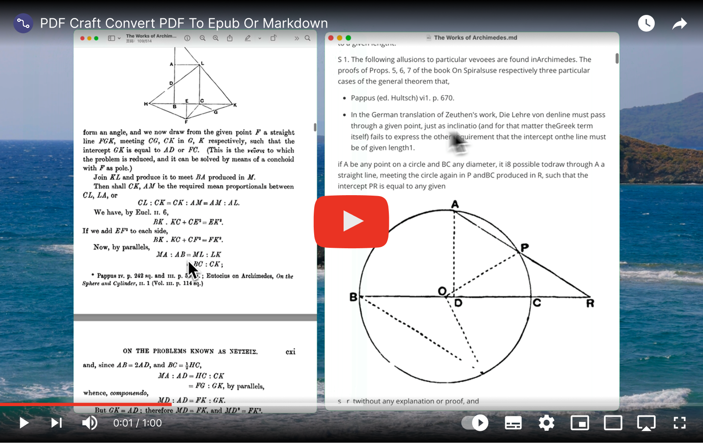
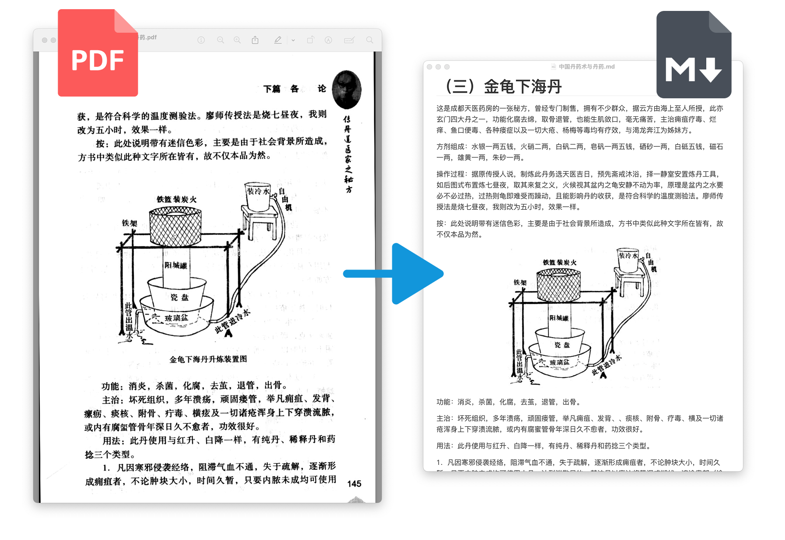
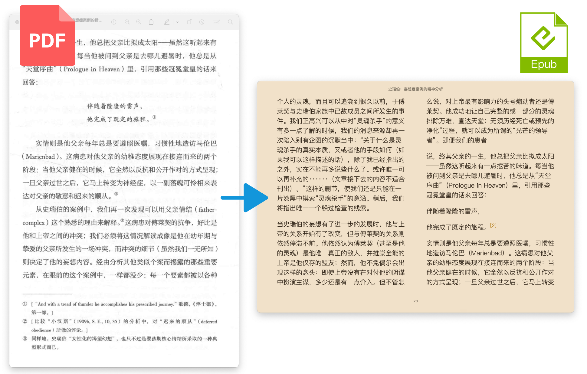
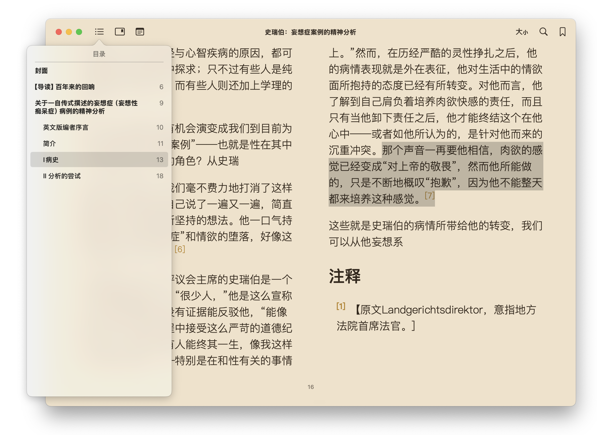
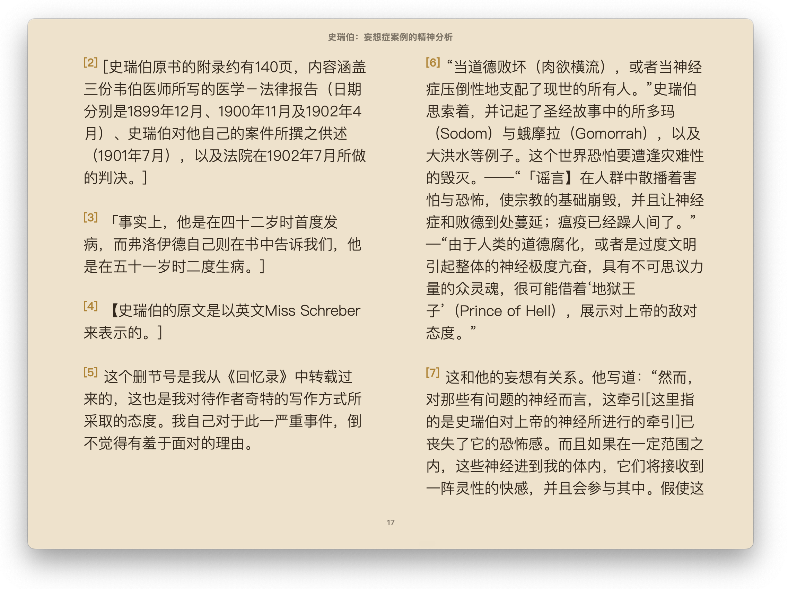

<div align=center>
  <h1>PDF Craft</h1>
  <p>
    <a href="https://github.com/oomol-lab/pdf-craft/actions/workflows/build.yml" target="_blank"></a>
    <a href="https://pypi.org/project/pdf-craft/" target="_blank"></a>
    <a href="https://pypi.org/project/pdf-craft/" target="_blank"></a>
    <a href="https://pypi.org/project/pdf-craft/" target="_blank"></a>
    <a href="https://github.com/oomol-lab/pdf-craft/blob/main/LICENSE" target="_blank"></a>
  </p>
  <p><a href="https://hub.oomol.com/package/pdf-craft?open=true" target="_blank"></a></p>
  <p><a href="./README.md">English</a> | 中文</p>
</div>


## 简介

PDF Craft 可以将 PDF 文件转化为各种其他格式。该项目将专注于扫描书籍的 PDF 文件的处理。如果你遇到问题或任何建议，请提交 [issues](https://github.com/oomol-lab/pdf-craft/issues)。

[](https://www.youtube.com/watch?v=EpaLC71gPpM)

本项目可将 PDF 一页一页读出，并使用 [DocLayout-YOLO](https://github.com/opendatalab/DocLayout-YOLO) 混合我写的一个算法，将书页中的正文提取出来，并过滤掉页眉、页脚、脚注、页码等元素。在跨页过程中，会使用算法判断以妥善处理前后文跨页顺接问题，最终生成语义通顺的文本。书页会使用 [OnnxOCR](https://github.com/jingsongliujing/OnnxOCR) 进行文本识别。并使用 [layoutreader](https://github.com/ppaanngggg/layoutreader) 来确定符合人类习惯的阅读顺序。

仅靠以上这些可在本地执行的 AI 模型（使用本地显卡设备来加速），便可将 PDF 文件转化为 Markdown 格式。这适应于论文或小书本。

但若要解析书籍（一般页数超过 100 页），建议将其转化为 [EPUB](https://en.wikipedia.org/wiki/EPUB) 格式的文件。转化过程中，本库会将本地 OCR 识别出的数据传给 [LLM](https://en.wikipedia.org/wiki/Large_language_model)，并通过特定信息（比如目录等）来构建书本的结构，最终生成带目录，分章节的 EPUB 文件。这个解析和构建的过程中，会通过 LLM 读取每页的注释和引用信息，然后在 EPUB 文件中以新的格式呈现。此外 LLM 还能在一定程度上校正 OCR 的错误。这一步骤无法全在本地执行，你需要配置 LLM 服务，推荐使用 [DeepSeek](https://www.deepseek.com/)，本库的 Prompt 基于 V3 模型调试。

## 安装

你需要 python 3.10 或以上（推荐 3.10.16）。

```shell
pip install pdf-craft
```
```shell
pip install onnxruntime==1.21.0
```

## 使用 CUDA

如果你希望使用 GPU 加速，需要确保你的设备以准备好 CUDA 环境。请参考 [PyTorch](https://pytorch.org/get-started/locally/) 的介绍，根据你的操作系统安装选择适当的命令安装。

此外，将前文安装 `onnxruntime` 的命令替换成如下：

```shell
pip install onnxruntime-gpu==1.21.0
```

## 功能

### PDF 转化为 MarkDown

此操作无需调用远程的 LLM，仅凭本地算力（CPU 或显卡）就可完成。第一次调用时会联网下载所需的模型。遇到文档中的插图、表格、公式，会直接截图插入到 MarkDown 文件中。

```python
from pdf_craft import create_pdf_page_extractor, PDFPageExtractor, MarkDownWriter

extractor: PDFPageExtractor = create_pdf_page_extractor(
  device="cpu", # 如果希望使用 CUDA，请改为 device="cuda" 这样的格式。
  model_dir_path="/path/to/model/dir/path", # AI 模型下载和安装的文件夹地址
)
with MarkDownWriter(markdown_path, "images", "utf-8") as md:
  for block in extractor.extract(pdf="/path/to/pdf/file"):
    md.write(block)
```

执行完成后，会在指定的地址生成一个 `*.md` 文件。若原 PDF 中有插图（或表格、公式），则会在 `*.md` 同级创建一个 `assets` 文件夹，以保存图片。而 MarkDown 文件中将以相对地址的形式引用 `assets` 文件夹中的图片。

转化效果如下。



### PDF 转化为 EPUB

此操作的前半部分与 PDF 转化 MarkDown（见前章节）相同，将使用 OCR 从 PDF 中扫描并识别文字。因此，也需要先构建 `PDFPageExtractor` 对象。

```python
from pdf_craft import create_pdf_page_extractor, PDFPageExtractor

extractor: PDFPageExtractor = create_pdf_page_extractor(
  device="cpu", # 如果希望使用 CUDA，请改为 device="cuda" 这样的格式。
  model_dir_path="/path/to/model/dir/path", # AI 模型下载和安装的文件夹地址
)
```

之后，需要配置 `LLM` 对象。建议使用使用 [DeepSeek](https://www.deepseek.com/)，本库的 Prompt 基于 V3 模型调试。

```python
from pdf_craft import LLM

llm = LLM(
  key="sk-XXXXX", # LLM 供应商提供的 key
  url="https://api.deepseek.com", # LLM 供应商提供的 URL
  model="deepseek-chat", # LLM 供应商提供的模型
  token_encoding="o200k_base", # 进行 tokens 估算的本地模型名（与 LLM 无关，若不关心就保留 "o200k_base"）
)
```

如上两个对象准备好后，就可以开始扫描并分析 PDF 书籍了。

```python
from pdf_craft import analyse

analyse(
  llm=llm, # 上一步准备好的 LLM 配置
  pdf_page_extractor=pdf_page_extractor, # 上一部准备好的 PDFPageExtractor 对象
  pdf_path="/path/to/pdf/file", # PDF 文件路径
  analysing_dir_path="/path/to/analysing/dir", # analysing 文件夹地址
  output_dir_path="/path/to/output/files", # 分析结果将写入这个文件夹
)
```

上述代码注意两个文件夹地址，其一是 `output_dir_path`，表示扫描和分析的结果（会有多个文件）应该保存在哪个文件夹。该地址应该指向一个空文件夹，若不存在，则会自动创建一个文件夹。

其二是 `analysing_dir_path`，用来存储分析过程中的中间状态。在扫描和分析成功后，这个文件夹及其内部文件将变得没用（你可以用代码将它们删除）。该地址应该指向一个文件夹，若不存在，则会自动创建一个文件夹。这个文件夹（及其内部文件）可以保存分析进度。若某次分析因为意外而中断，可以通过将 `analysing_dir_path` 配置到上次被中断而产生的 analysing 文件夹，从而从上次被中断的点恢复并继续分析。特别的，如果你要开始一个全新的任务，请手动删除或清空 `analysing_dir_path` 文件夹，避免误触发中断恢复功能。

在分析结束后，将 `output_dir_path` 文件夹地址传递给如下代码作为参数，即可最终生成 EPUB 文件。

```python
from pdf_craft import generate_epub_file

generate_epub_file(
  from_dir_path=output_dir_path, # 来自上一步分析所产生的文件夹
  epub_file_path="/path/to/output/epub", # 生成的 EPUB 文件保存路径
)
```

该步骤会根据之前分析的书本结构，在 EPUB 中分章节，并匹配恰当的目录结构。此外，原本书页底部的注释和引用将以合适的方式呈现在 EPUB 中。





## 功能进阶

### 多重 OCR

通过对同一页进行多次 OCR 来提高识别质量，避免字迹模糊而丢失文字的问题。

```python
from pdf_craft import create_pdf_page_extractor, OCRLevel

extractor = create_pdf_page_extractor(
  ..., # 其他参数
  ocr_level=OCRLevel.OncePerLayout,
)
```

### 识别公式与表格

构造的 `PDFPageExtractor` 在识别文件时，默认会直接将原始页中的公式与表格裁剪出来，当作图片处理。你可以在构造它时添加配置，改变默认行为，以让其将公式和表格提取出来。

配置 `extract_formula` 参数的值为 `True`，将启用 [LaTeX-OCR](https://github.com/lukas-blecher/LaTeX-OCR) 来识别原始页中的公式，并以 [LaTeX](https://zh.wikipedia.org/zh-hans/LaTeX) 的形式存储。

配置 `extract_table_format` 的参数并指定形式，将启动 [StructEqTable](https://github.com/Alpha-Innovator/StructEqTable-Deploy) 来处理原始页中的表格，并以制定的形式存储。**注意：该功能需要本地设备支持 CUDA（并配置 `device="cuda"` 参数）**，否则功能将回退到默认行为。

#### 在转 Markdown 中的应用

在构建 `PDFPageExtractor` 时插入前文提及的两个参数，以在转 Markdown 时开启公式、表格识别。

```python
from pdf_craft import create_pdf_page_extractor, ExtractedTableFormat

extractor = create_pdf_page_extractor(
  ..., # 其他参数
  extract_formula=True, # 开启公式识别
  extract_table_format=ExtractedTableFormat.MARKDOWN, # 开启表格识别（以 MarkDown 格式保存）
)
```

特别的，对于转 Markdown 场景时，`extract_table_format` 只有设置为 `ExtractedTableFormat.MARKDOWN` 。

#### 在转 EPub 中的应用

同上一章节所述，需要在构建时插入那两个参数。但需注意，`extract_table_format` 的值应为 `ExtractedTableFormat.HTML` 。

```python
from pdf_craft import create_pdf_page_extractor, ExtractedTableFormat

extractor = create_pdf_page_extractor(
  ..., # 其他参数
  extract_formula=True, # 开启公式识别
  extract_table_format=ExtractedTableFormat.HTML, # 开启表格识别（以 MarkDown 格式保存）
)
```

此外，在接下来调用 `generate_epub_file()` 函数时，还需要配置 `table_render` 和 `latex_render`，以分别指定识别出的表格、公式以何种方式在 EPub 文件中渲染。

```python
from pdf_craft import generate_epub_file, TableRender, LaTeXRender

generate_epub_file(
  ..., # 其他参数
  table_render=TableRender.HTML, # 表格渲染模式
  latex_render=LaTeXRender.SVG, # 公式渲染模式
)
```

对于表格渲染模式（`TableRender`），只有 `HTML` 和 `CLIPPING` 两种。前者表示以 HTML 的形式（即 `<table>` 相关的标签）渲染，后者是默认渲染模式，即从原始页中截图。

对于公式的渲染模式（`LaTeXRender`），有 `MATHML`、`SVG`、`CLIPPING` 三种。其中`CLIPPING` 是默认行为，即从原始页中截图。前两种我将分别介绍。

`MATHML` 表示以 [MathML](https://en.wikipedia.org/wiki/MathML) 标签在 EPub 文件中渲染，这是一种 XML 应用的数学标记语言。但请注意，在 EPub 2.0 中并不支持这种语言。这意味若使用这种渲染方式，并非所有的 EPub 阅读器都能正确渲染公式。

`SVG` 表示将识别出的公式以 [SVG](https://en.wikipedia.org/wiki/SVG) 文件的形式渲染。这是一种无损图片格式，也意味着以此方式渲染的公式可以在任意支持 EPub 2.0 的阅读器中正确展示。但该配置需要在本地安装 `latex`，若未安装，则运行时会报错。你可以通过如下命令测试本地设备是否正确安装。

```shell
latex --version
```

### 温度与创造力

前文提及 `LLM` 的构建，可以为其添加更多的参数来实现更丰富的功能。以实现断线重连，或指定特定的超时时间。

```python
llm = LLM(
  ..., # 其他参数
  top_p=0.8, # Top P 创造力（可选）
  temperature=0.3, # 温度（可选）
)
```

此外可将 `top_p` 和 `temperature` 设置成一个范围。在一般情况下，它们的取值会取范围最左边的值。一旦 LLM 返回断裂的内容，则在重试时逐渐将值朝右边移动（不会超过范围的右边界）。以免 LLM 陷入总是返回断裂内容的循环之中。

```python
llm = LLM(
  ..., # 其他参数
  top_p=(0.3, 1.0) # 创造力（可选）
  temperature=(0.3, 1.0), # 温度（可选）
)
```

### 文字勘误

由于原始扫描件不清晰或污损，可能导致 OCR 将部分内容识别错误。可利用 LLM 根据上下文推断找出这些错误，并修正。在调用 `analyse` 方法时，配置 `correction_mode` 可开启勘误功能。

```python
from pdf_craft import analyse, CorrectionMode

analyse(
  ..., # 其他参数
  correction_mode=CorrectionMode.ONCE,
)
```

### 分析请求拆分

在调用 `analyse` 方法时，配置 `window_tokens` 字段来修改每一次发起 LLM 请求时，提交的书籍内容的最大 token 数。这个值越小，分析过程中向 LLM 发起的请求次数就会越多，但相应的，LLM 一次处理的数据就越少。通常来说，LLM 处理的数据越少，效果会越好，但消耗的总 token 数会越多。调整这个字段，以在质量和费用之间寻求平衡。

```python
from pdf_craft import analyse

analyse(
  ..., # 其他参数
  window_tokens=2000, # 请求窗口中最大 token 数
)
```

也可以通过构建 `LLMWindowTokens` 来精确设置某个具体的 token 限制。

```python
from pdf_craft import analyse, LLMWindowTokens

analyse(
  ..., # 其他参数
  window_tokens=LLMWindowTokens(
    max_request_data_tokens=4096,
    max_verify_paragraph_tokens=512,
    max_verify_paragraphs_count=8,
  ),
)
```

## 致谢

- [doc-page-extractor](https://github.com/Moskize91/doc-page-extractor)
- [DocLayout-YOLO](https://github.com/opendatalab/DocLayout-YOLO)
- [OnnxOCR](https://github.com/jingsongliujing/OnnxOCR)
- [layoutreader](https://github.com/ppaanngggg/layoutreader)
- [StructEqTable](https://github.com/Alpha-Innovator/StructEqTable-Deploy)
- [LaTeX-OCR](https://github.com/lukas-blecher/LaTeX-OCR)
