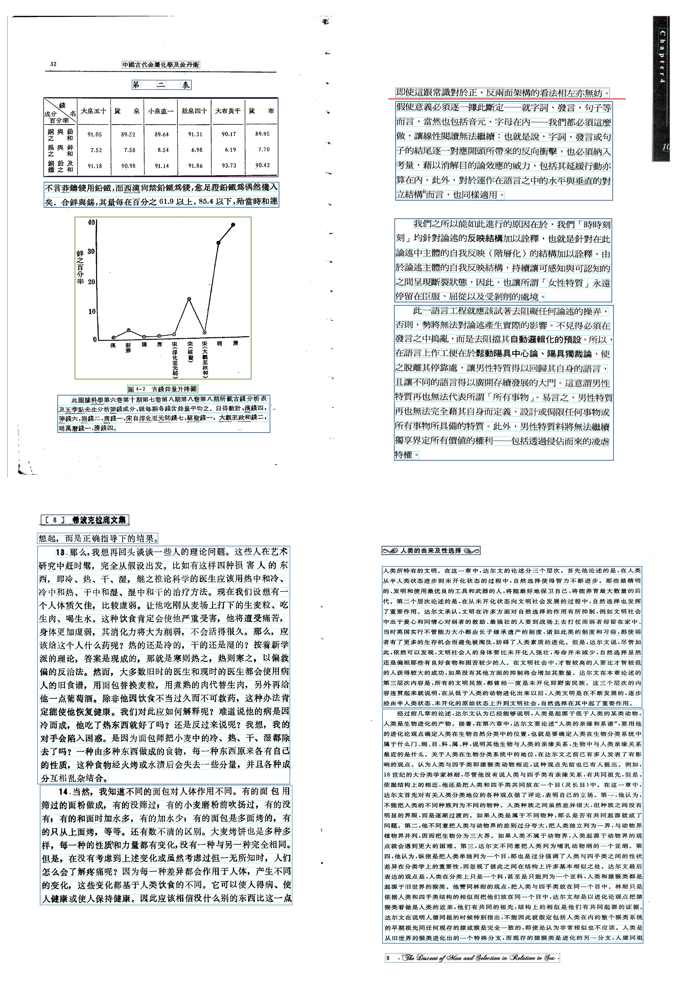
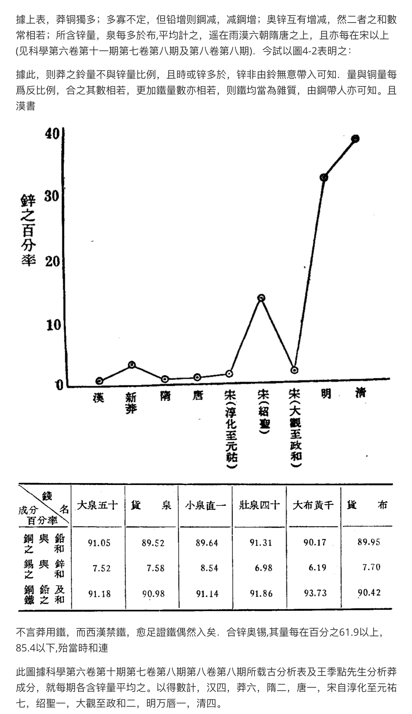

# pdf-craft

[English](./README.md) | 中文

## 简介

PDF craft 可以将 PDF 文件转化为各种其他格式（目前仅支持 MarkDown 格式）。该项目将专注于扫描书籍的 PDF 文件的处理。目前项目刚刚启动，如果你碰到问题或任何建议，请在 [issues](https://github.com/oomol-lab/pdf-craft/issues) 提交。

本项目可将 PDF 一页一页读出，并使用 [DocLayout-YOLO](https://github.com/opendatalab/DocLayout-YOLO) 混合我写的一个算法，将书页中的正文提取出来，并过滤掉页眉、页脚、脚注、页码等元素。在跨页过程中，会使用算法判断以妥善处理前后文跨页顺接问题，最终生成语义通顺的文本。

我目前将专注直接扫描生成的中文 PDF 书籍。书页会使用 [PaddleOCR](https://github.com/PaddlePaddle/PaddleOCR) 进行文本识别。并使用 [layoutreader](https://github.com/ppaanngggg/layoutreader) 来确定符合人类习惯的阅读顺序。

## 安装

```shell
pip install pdf-craft
```

## 使用 CUDA

如果你希望使用 GPU 加速，需要确保你的设备以准备好 CUDA 环境。请参考 [PyTorch](https://pytorch.org/get-started/locally/) 的介绍，根据你的操作系统安装选择适当的命令安装。

## 快速开始

```python
from pdf_craft import PDFPageExtractor, MarkDownWriter

extractor = PDFPageExtractor(
  device="cpu", # 如果希望使用 CUDA，请改为 device="cuda:0" 这样的格式。
  model_dir_path="/path/to/model/dir/path", # AI 模型下载和安装的文件夹地址
)
with MarkDownWriter(markdown_path, "images", "utf-8") as md:
  for blocks in extractor.extract(pdf="/path/to/pdf/file", lang="ch"):
    for block in blocks:
      md.write(block)
```

## 效果




## 致谢

- [DocLayout-YOLO](https://github.com/opendatalab/DocLayout-YOLO)
- [PaddleOCR](https://github.com/PaddlePaddle/PaddleOCR)
- [layoutreader](https://github.com/ppaanngggg/layoutreader)