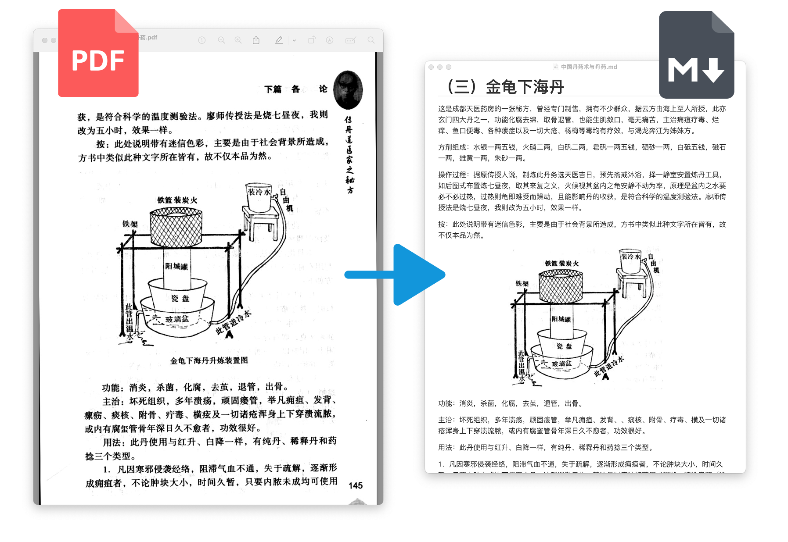
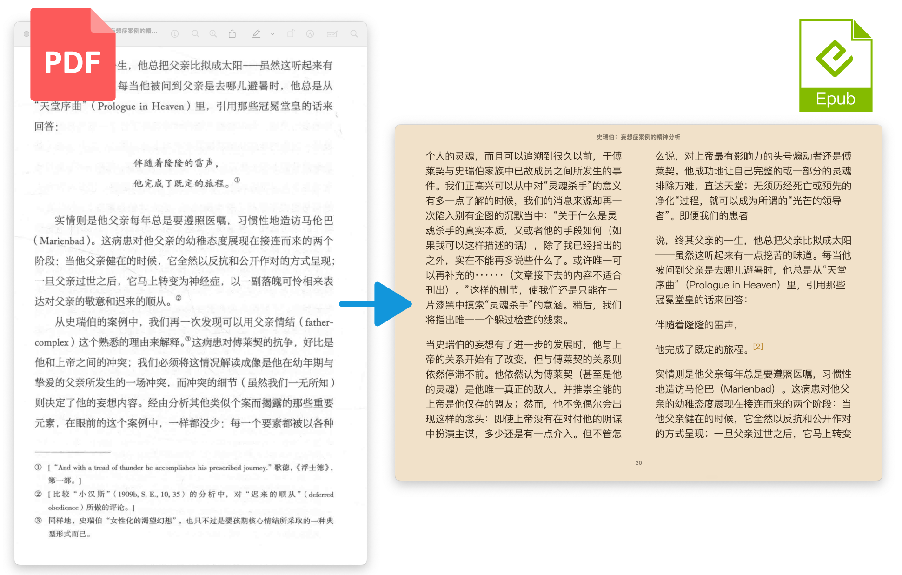

<!-- Translation baseline: README.md. Keep capability descriptions and executable examples aligned. -->
<div align="center">
  
  <p><a href="README.md">English</a> | <strong>简体中文</strong> | <a href="docs/zh-TW/README.md">繁體中文</a> | <a href="docs/ja/README.md">日本語</a> | <a href="docs/ko/README.md">한국어</a> | <a href="docs/ru/README.md">Русский</a> | <a href="docs/fr/README.md">Français</a> | <a href="docs/es/README.md">Español</a> | <a href="docs/de/README.md">Deutsch</a> | <a href="docs/it/README.md">Italiano</a></p>
  <p>
    <a href="https://pypi.org/project/pdf-craft/"></a>
    <a href="https://pypi.org/project/pdf-craft/"></a>
    <a href="https://github.com/oomol-lab/pdf-craft/actions/workflows/merge-build.yml"></a>
    <a href="LICENSE"></a>
  </p>
  <p>
    <a href="https://inkora.oomol.com/pdf-craft/"><strong>在线体验</strong></a> ·
    <a href="#quick-start"><strong>Python 快速开始</strong></a> ·
    <a href="#documentation"><strong>使用文档</strong></a>
  </p>
</div>

将扫描版 PDF 转换为 Markdown 和 EPUB，支持内容翻译与译文写回 PDF。

## 从扫描页面，到可用的文档

PDF Craft 是一个面向扫描书籍和学术、技术文档的 Python 库。它将页面中的文字提取出来，围绕正文、章节、目录、脚注、表格、公式和图片组织转换结果，让书籍可以继续编辑、整理和阅读。

**Markdown：用于编辑、检索和后续内容处理。**



**EPUB：用于在电子书阅读器中阅读。**



转换效果取决于原稿清晰度、页面排版和所选 OCR 模型。建议先用有代表性的文档检查输出，再处理整批文件。

## 你可以用它做什么

| 你的目标 | PDF Craft 提供的能力 |
| --- | --- |
| 把扫描书籍整理成可编辑文档 | PDF → Markdown，提取文字并输出图片等资源 |
| 在电子书阅读器中阅读扫描书籍 | PDF → EPUB，支持书名、作者和目录等书籍信息 |
| 阅读其他语言的书籍 | 转换时翻译内容，或直接翻译已有 EPUB；支持仅译文和双语输出方式 |
| 获得译文版 PDF | 翻译识别出的内容，将译文写回原始 PDF 页面 |
| 将转换接入自己的应用 | 通过 Python API 调用；保存提取结果，复用于后续渲染或翻译 |

## 选择你的使用方式

| 使用方式 | 适合谁 | 需要准备 |
| --- | --- | --- |
| **[在线体验](https://inkora.oomol.com/pdf-craft/)** | 希望先看看效果的用户 | 浏览器；功能与使用要求以在线应用为准 |
| **Python + 远程 OCR** | 希望接入代码、不在本机运行 OCR 模型的开发者 | Python、Poppler、兼容 OCR 服务的地址与凭据 |
| **Python + 本地 OCR** | 希望在自己的 NVIDIA GPU 上运行识别的开发者 | Python、Poppler、CUDA 环境、显存与模型文件 |

远程 OCR 会将页面发送给所配置的服务，本机无需 CUDA。本地 OCR 使用本机算力；如果另外配置远程 LLM 进行翻译或目录分析，相应内容仍会发送给该服务。

<details>
<summary>查看在线应用界面</summary>

[](https://inkora.oomol.com/pdf-craft/)

</details>

<a id="quick-start"></a>

## 快速开始

下面使用远程 OCR，将一个 PDF 转换为 Markdown。开始前请准备 **Python 3.11–3.13、Poppler，以及可用的 DeepSeek OCR 兼容服务配置**。Poppler 的安装方式见[安装指南](docs/zh-CN/INSTALLATION.md)。

### 1. 安装

```bash
python -m pip install pdf-craft
```

### 2. 转换 PDF

将待转换文件命名为 `input.pdf`，放在运行脚本的目录下。替换下面的服务地址、密钥和模型名后运行：

```python
from pdf_craft import DeepSeekOCRVendorConfig, PDFCraft, PDFOptions

craft = PDFCraft(
    pdf=PDFOptions(
        ocr=DeepSeekOCRVendorConfig(
            base_url="https://example.com/v1",
            api_key="your-api-key",
            model="deepseek-ocr",
        ),
    ),
)

craft.convert_pdf_to_markdown("input.pdf", "output.md")
```

`https://example.com/v1` 是占位地址，不能直接调用；请使用实际提供相应 OCR 模型的兼容服务。其他模型的配置见 [OCR 配置指南](docs/zh-CN/OCR_BACKENDS.md)。

转换完成后，打开 `output.md` 查看结果。包含图片的文档还会生成相关资源文件，移动或分享 Markdown 时请一并保留。

### 3. 生成 EPUB

沿用上面的 `craft` 实例，将最后一行替换为：

```python
craft.convert_pdf_to_epub("input.pdf", "output.epub")
```

转换完成后，即可用 EPUB 阅读器打开 `output.epub`。设置书名、作者及其他输出选项，见 [PDF 转换与翻译指南](docs/zh-CN/PDF_TRANSLATION.md)。

遇到安装或运行问题？查看[故障排查指南](docs/zh-CN/TROUBLESHOOTING.md)。

## 翻译与提取结果复用

**翻译书籍。** 可以在 PDF 转换为 Markdown 或 EPUB 时加入章节翻译器，也可以直接翻译已有 EPUB。翻译需要独立的文本 LLM 调用；OCR 服务负责页面识别，两者使用各自的配置。已有 EPUB 的翻译支持仅保留译文，或追加译文以便双语阅读。

**生成译文 PDF。** 如果你需要 PDF 输出，可以先提取内容，再将翻译后的文字写回原始页面。此流程还需要 Ghostscript 和可用的本机字体；排版效果需要结合原稿与译文检查。

**一次提取，多次使用。** 将提取结果保存为 `.pcex` 文件，可以在后续渲染、翻译或跨机器处理时复用：

```python
craft.convert_pdf_to_markdown(
    "input.pdf",
    "output.md",
    extraction_path="book.pcex",
)
```

具体步骤见 [PDF 转换与翻译](docs/zh-CN/PDF_TRANSLATION.md)、[EPUB 翻译](docs/zh-CN/EPUB_TRANSLATION.md)和 [`.pcex` 格式参考](docs/zh-CN/PCEX_FORMAT.md)。

## OCR 与运行要求

PDF Craft 支持 **DeepSeek OCR、DeepSeek OCR 2 和 Unlimited OCR**，每个模型系列都有本地和远程配置。

远程 OCR 使用标准安装包。如果你明确需要本地 OCR，请安装额外依赖：

```bash
python -m pip install "pdf-craft[local]"
```

本地运行还需要匹配的 CUDA 版 PyTorch、足够显存和模型文件。模型默认从 Hugging Face 下载，也可以预先下载后从本地加载。各模型的预设和要求不同，请按 [OCR 配置指南](docs/zh-CN/OCR_BACKENDS.md)选择。

**语言支持取决于处理环节。** README 的语言版本表示文档可用语言；文字识别取决于 OCR 模型，翻译取决于翻译器与文本 LLM。EPUB 的 `lan` 参数当前提供 `zh` / `en` 选项，具体见 [API 参考](docs/zh-CN/API_REFERENCE.md)。

<a id="documentation"></a>

## 文档导航

| 我想了解 | 文档 |
| --- | --- |
| 安装系统依赖、配置本地 GPU | [安装指南](docs/zh-CN/INSTALLATION.md) |
| 选择 OCR 模型、配置远程服务或模型缓存 | [OCR 配置指南](docs/zh-CN/OCR_BACKENDS.md) |
| 转换 PDF、生成 EPUB、翻译并写回 PDF | [PDF 转换与翻译](docs/zh-CN/PDF_TRANSLATION.md) |
| 翻译已有 EPUB，设置双语输出 | [EPUB 翻译指南](docs/zh-CN/EPUB_TRANSLATION.md) |
| 查询参数、类型和调用方式 | [API 参考](docs/zh-CN/API_REFERENCE.md) |
| 存储或交换提取结果 | [`.pcex` 格式参考](docs/zh-CN/PCEX_FORMAT.md) |
| 解决安装、识别与输出问题 | [故障排查](docs/zh-CN/TROUBLESHOOTING.md) |

## 反馈与贡献

欢迎通过 [Issues](https://github.com/oomol-lab/pdf-craft/issues)报告问题或提出建议。转换问题请尽量附上项目版本、OCR 配置类型、错误日志，以及可公开分享的最小复现文件；提交前移除密钥和私人内容。

也欢迎通过 [Pull Requests](https://github.com/oomol-lab/pdf-craft/pulls)改进代码、文档和翻译。贡献新语言版本时，请与英文 README 保持能力说明和示例一致。

如果 PDF Craft 对你有帮助，欢迎给项目一颗 Star，让更多需要处理扫描书籍的人发现它。

## 相关项目

[Wiki Graph](https://github.com/oomol-lab/wiki-graph) 可以继续处理转换后的 EPUB 或 Markdown，生成结构化摘要、章节拓扑和知识图谱。

## 许可证与致谢

PDF Craft 使用 [MIT 许可证](LICENSE)。第三方依赖及所选 OCR 模型适用各自的许可证。

感谢 [DeepSeek OCR](https://github.com/deepseek-ai/DeepSeek-OCR)、[DeepSeek OCR 2](https://github.com/deepseek-ai/DeepSeek-OCR-2)、[Unlimited OCR](https://github.com/baidu/Unlimited-OCR)、[doc-page-extractor](https://github.com/Moskize91/doc-page-extractor) 和 [pyahocorasick](https://github.com/WojciechMula/pyahocorasick) 等开源项目。

<!-- community-footer:start -->

## 贡献者

感谢每一位为 PDF Craft 作出贡献的人。欢迎参与代码、文档和翻译的改进。

[](https://github.com/oomol-lab/pdf-craft/graphs/contributors)

## Star History

<!-- star-history:start -->
<a href="https://www.star-history.com/#oomol-lab/pdf-craft&amp;Date">
  <picture>
    <source media="(prefers-color-scheme: dark)" srcset="https://api.star-history.com/svg?repos=oomol-lab/pdf-craft&amp;type=Date&amp;theme=dark" />
    <source media="(prefers-color-scheme: light)" srcset="https://api.star-history.com/svg?repos=oomol-lab/pdf-craft&amp;type=Date" />
    
  </picture>
</a>
<!-- star-history:end -->
<!-- community-footer:end -->
