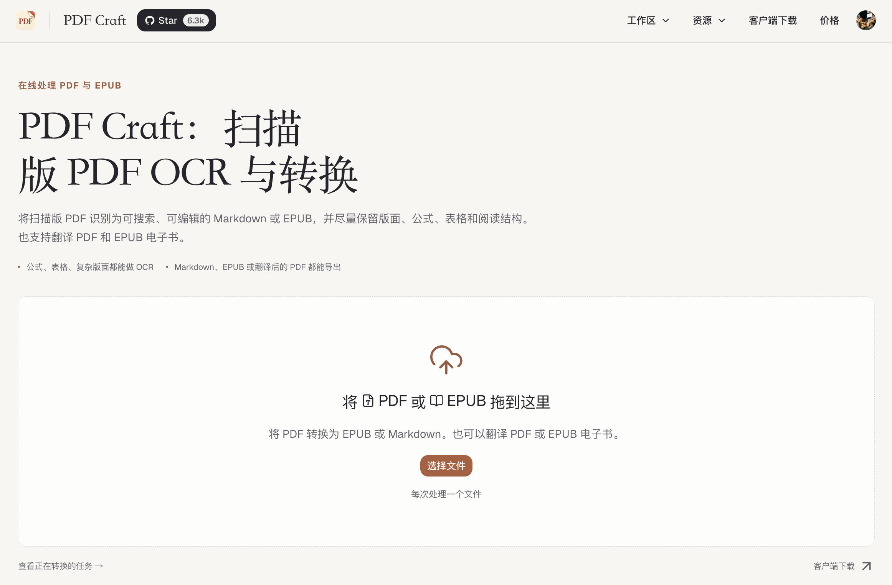

  <h1>PDF Craft</h1>
  

    
    
    
    
    
    
  

  

  
<a href="./README.md">English</a> | 中文

## pdf-craft 是什么

pdf-craft 是以 PDF 文件格式为中心构建的转换库，支持将 PDF 转换为 Markdown 或 EPUB，
也支持对转换后的内容进行翻译。它尤其擅长处理扫描件：可以把原本只能翻页阅读的扫描 PDF 转换成可编辑、
可检索的 Markdown 或 EPUB，也可以在转换时直接完成翻译。

pdf-craft 围绕书籍和学术、技术文档的结构设计，支持识别正文、目录、脚注、表格、公式
和图片等内容。OCR 支持 [DeepSeek OCR](https://github.com/deepseek-ai/DeepSeek-OCR)、
[DeepSeek OCR 2](https://github.com/deepseek-ai/DeepSeek-OCR-2) 和百度
[Unlimited OCR](https://github.com/baidu/Unlimited-OCR)。你可以利用本地设备（如果你的显卡支持）的算力运行 OCR，也可以配置远端供应商完成 OCR 工作。

若涉及翻译等操作，需要配置 LLM。

## 在线版本

如果你希望在不进行本地安装的情况下体验 pdf-craft，可以试试 [Inkora - PDF Craft](https://inkora.oomol.com/pdf-craft/)，这是一个基于相同 PDF 转换流程构建的在线应用。你可以直接上传 PDF 文件，在浏览器中体验主要功能。

## 安装

如果你只是想开始使用 pdf-craft，安装这一版即可：

~~~bash
pip install pdf-craft
~~~

这个安装包包含远程 OCR、Markdown/EPUB 渲染和 PDF 翻译所需的依赖。远程 OCR 使用服务
端的计算资源，因此本机不需要准备 CUDA；你只需要在代码中的配置对象里填写服务地址、
模型名和访问密钥。

只有在你明确希望让 OCR 模型运行在自己的 NVIDIA 显卡上时，才需要额外安装本地 OCR
依赖；如果你不确定，请使用上面的默认安装：

~~~bash
pip install "pdf-craft[local]"
~~~

这项安装会增加 Hugging Face、Transformers 等本地模型运行时；实际运行还需要支持 CUDA
的 PyTorch、模型缓存和足够的显存。没有这类设备时，使用前面的默认安装。

项目支持 Python 3.11、3.12 和 3.13。处理 PDF 前还需要安装 Poppler，完整步骤请参考
[安装指南](docs/INSTALLATION_zh-CN.md)。

## 快速开始

下面的例子会把一个扫描版 PDF 转换成 Markdown 文件。代码使用远程 OCR 识别页面，因此
你只需要把示例中的服务地址、模型名和访问密钥替换成自己的配置。

~~~python
from pdf_craft import DeepSeekOCRVendorConfig, PDFCraft, PDFOptions

craft = PDFCraft(pdf=PDFOptions(ocr=DeepSeekOCRVendorConfig(
    base_url="https://example.com/v1",
    api_key="your-api-key",
    model="deepseek-ocr",
)))
craft.convert_pdf_to_markdown(
    "input.pdf", "output.md",
)
~~~

转换过程会自动使用系统临时目录，并在完成或发生异常后清理。如果需要保留中间结果以便
调试或重复使用，可以显式传入 `package_path`。

## 高级功能

### 将 PDF 转换为 EPUB

如果你希望得到 EPUB，请使用 `convert_pdf_to_epub`。下面是一个完整的
示例：

~~~python
from pdf_craft import (
    BookMeta,
    DeepSeekOCRVendorConfig,
    PDFCraft,
    PDFOptions,
)

ocr_config = DeepSeekOCRVendorConfig(
    base_url="https://example.com/v1",
    api_key="your-api-key",
    model="deepseek-ocr",
)
craft = PDFCraft(pdf=PDFOptions(ocr=ocr_config))
craft.convert_pdf_to_epub(
    "input.pdf", "output.epub",
    book_meta=BookMeta(title="书名", authors=["作者"]),
)
~~~

`book_meta` 用于填写 EPUB 的书名和作者信息；如果不提供，pdf-craft 会尝试读取 PDF
自身的元数据。

### 转换 PDF 时同时翻译

如果你希望 PDF 在转换为 Markdown 或 EPUB 的同时完成翻译，可以给转换方法增加翻译步骤。
`translator` 是一个章节翻译器，负责把章节文字交给文本 LLM 并返回译文；准备好它以后，
用 `TranslationStep` 将翻译步骤传给转换方法。同一个翻译步骤可以用于两种输出格式：

~~~python
from pdf_craft import TranslationStep

translation = TranslationStep(translator)

craft.convert_pdf_to_markdown(
    "input.pdf", "translated.md", steps=[translation],
)
craft.convert_pdf_to_epub(
    "input.pdf", "translated.epub", steps=[translation],
)
~~~

### 翻译 PDF

如果你的目标是得到翻译后的 PDF，使用 PDFCraft 的 PDF 翻译流程。它会识别 PDF 内容、
翻译文字，并把翻译结果写回原始页面。翻译使用独立的文本 LLM 配置，不要把 OCR 服务
地址当作翻译服务地址。

下面的例子把 `input.pdf` 翻译成中文并保存为 `translated.pdf`。`translator` 需要连接
你的文本 LLM，并接收一段文字后返回译文：

~~~python
from pdf_craft import DeepSeekOCRVendorConfig, PDFCraft, PDFOptions

craft = PDFCraft(pdf=PDFOptions(ocr=DeepSeekOCRVendorConfig(
    base_url="https://example.com/v1",
    api_key="your-ocr-api-key",
    model="deepseek-ocr",
)))

# 请替换为你自己的文本 LLM 调用。
def translator(text: str) -> str:
    return text  # 这里只是占位；实际应调用文本 LLM，将 text 翻译成中文

package = craft.extract_pdf("input.pdf", "work/cache")
craft.translate_pdf("input.pdf", package, "translated.pdf", translator)
~~~

### 翻译 EPUB

如果手头已经有 EPUB 文件，可以直接指定输入文件、输出文件、目标语言和文本 LLM：

~~~python
from pdf_craft import LLM, PDFCraft, SubmitKind

llm = LLM(
    key="your-api-key",
    url="https://api.openai.com/v1",
    model="gpt-4.1-mini",
    token_encoding="o200k_base",
)

PDFCraft().translate_epub(
    "input.epub", "translated.epub",
    target_language="zh", submit=SubmitKind.REPLACE, llm=llm,
)
~~~

这里的 `target_language="zh"` 表示翻译成中文。`REPLACE` 用译文替换原文，适合只保留
目标语言；`APPEND_BLOCK` 保留原文，并把译文追加为新的文本块，适合双语对照阅读；
`APPEND_TEXT` 则将译文直接接在原文后。译文会尽量保留原 EPUB 的排版、插图和目录结构。

提示词、并发、缓存恢复、进度回调、失败处理及双 LLM 配置，请参考
[EPUB 翻译指南](docs/EPUB_TRANSLATION_zh-CN.md)。

## OCR backend 与模型缓存

OCR（光学字符识别）负责把 PDF 页面图片识别成文字。pdf-craft 提供六种 OCR 方式，
先按下面的规则决定运行位置，再决定使用哪一家模型：

- **没有 CUDA、希望少配置本机环境**：选择 vendor OCR。识别会上传到远程服务并使用
  远端的计算资源，需要网络连接、服务地址和访问密钥。
- **有支持 CUDA 的 NVIDIA 显卡、希望在本机运行**：选择 local OCR。模型会下载到本地
  缓存，并直接使用本机显卡；可以减少数据外发，但需要自行准备 CUDA、显存和模型文件。

三种模型的归属如下：[DeepSeek OCR](https://github.com/deepseek-ai/DeepSeek-OCR) 和
[DeepSeek OCR 2](https://github.com/deepseek-ai/DeepSeek-OCR-2) 来自 DeepSeek，
[Unlimited OCR](https://github.com/baidu/Unlimited-OCR) 来自百度。每个模型都有本地运行
和远程服务两种配置，因此一共是六种 backend。

| 选择 | 模型归属 | 运行位置 | 什么时候选 | 需要准备 |
| --- | --- | --- | --- | --- |
| `DeepSeekOCRLocalConfig` | DeepSeek | 本机 GPU | 有 CUDA，想在本机运行 DeepSeek OCR | CUDA、显存、模型缓存 |
| `DeepSeekOCR2LocalConfig` | DeepSeek | 本机 GPU | 有 CUDA，想使用 DeepSeek OCR 2 | CUDA、显存、模型缓存；推荐 `base` preset |
| `UnlimitedOCRLocalConfig` | 百度 | 本机 GPU | 有 CUDA，想使用百度 Unlimited OCR | CUDA、显存、模型缓存 |
| `DeepSeekOCRVendorConfig` | DeepSeek | 远程服务 | 没有 CUDA，或希望直接调用远程 DeepSeek OCR | 服务地址、模型名、访问密钥、网络 |
| `DeepSeekOCR2VendorConfig` | DeepSeek | 远程服务 | 没有 CUDA，或希望直接调用远程 DeepSeek OCR 2 | 服务地址、模型名、访问密钥、网络 |
| `UnlimitedOCRVendorConfig` | 百度 | 远程服务 | 没有 CUDA，或希望直接调用百度 Unlimited OCR | 服务地址、模型名、访问密钥、网络 |

如果你只是想先把流程跑通，优先选择自己已有凭据的 vendor OCR；如果你要离线运行，
再选择对应的 local OCR。库 API 的 `ocr` 参数接收上表中的配置对象，不读取环境变量。

Unlimited OCR local 仅支持 base 和 gundam；DeepSeek OCR 2 local 的已验证路径使用
base，显式使用 tiny 会快速失败并提示改用 base。

### 模型缓存与常用参数

本地 OCR 默认会从 Hugging Face 下载模型。你也可以提前下载并指定模型缓存目录，之后
使用 `local_only=True`，让运行过程只读取本地文件：

~~~python
from pdf_craft import DeepSeekOCRLocalConfig, predownload_models

predownload_models(
    ocr=DeepSeekOCRLocalConfig(models_cache_path="models"),
    revision=None,
)
~~~

ocr_size 可使用 tiny、small、base、large 和 gundam，但不同 backend 的 preset 不完全
相同。Markdown 默认 toc_assumed=False，EPUB 默认 toc_assumed=True；复杂目录可以
传入 toc_llm。

## 开发

本地贡献者环境、验证命令、手动转换检查和 VGE worktree 说明，请参考[开发指南](docs/DEVELOPMENT_zh-CN.md)。

## 相关项目

- [Wiki Graph](https://github.com/oomol-lab/wiki-graph)：如果你想进一步把转换后的书提炼成结构化摘要，Wiki Graph 可以基于 EPUB 或 Markdown 生成摘要、章节拓扑和知识图谱。

## 许可证

本项目采用 MIT 许可证。详见 [LICENSE](./LICENSE) 文件。

自 v1.0.0 起，pdf-craft 全面迁移到 DeepSeek OCR（MIT 协议），移除了原有的 AGPL-3.0 依赖，使得整个项目能够以更宽松的 MIT 协议发布。注意 pdf-craft 通过 DeepSeek OCR 间接依赖了 easydict（LGPLv3 协议）。感谢社区的支持与贡献！

## 致谢

- [DeepSeekOCR](https://github.com/oomol-lab/DeepSeek-OCR)
- [doc-page-extractor](https://github.com/Moskize91/doc-page-extractor)
- [pyahocorasick](https://github.com/WojciechMula/pyahocorasick)
