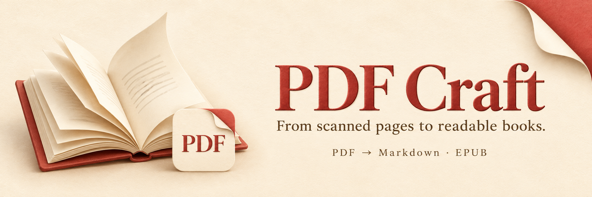
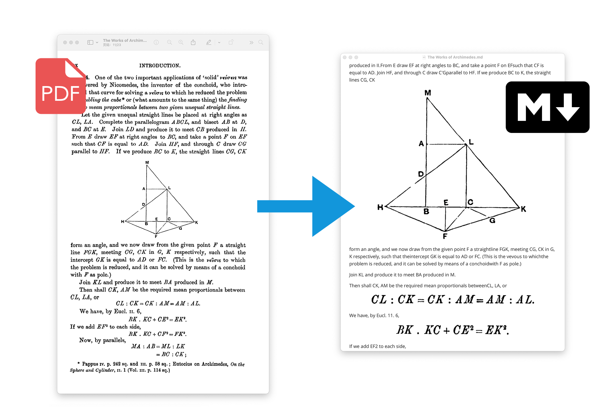
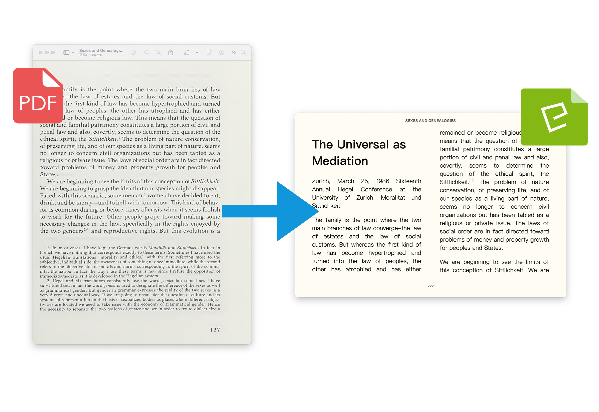
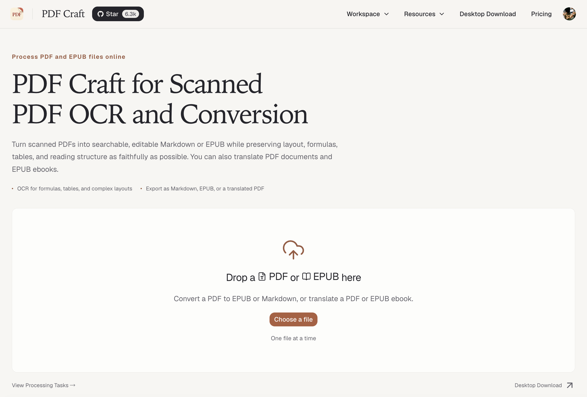

<!-- Translation baseline: README.md. Keep capability descriptions and executable examples aligned. -->
<div align="center">
  
  <p><a href="../../README.md">English</a> | <a href="../../README_zh-CN.md">简体中文</a> | <a href="../zh-TW/README.md">繁體中文</a> | <a href="../ja/README.md">日本語</a> | <a href="../ko/README.md">한국어</a> | <a href="../ru/README.md">Русский</a> | <a href="../fr/README.md">Français</a> | <a href="../es/README.md">Español</a> | <a href="../de/README.md">Deutsch</a> | <strong>Italiano</strong></p>
  <p>
    <a href="https://pypi.org/project/pdf-craft/"></a>
    <a href="https://pypi.org/project/pdf-craft/"></a>
    <a href="https://github.com/oomol-lab/pdf-craft/actions/workflows/merge-build.yml"></a>
    <a href="../../LICENSE"></a>
  </p>
  <p>
    <a href="https://inkora.oomol.com/pdf-craft/"><strong>Prova online</strong></a> ·
    <a href="#quick-start"><strong>Guida rapida Python</strong></a> ·
    <a href="#documentation"><strong>Documentazione</strong></a>
  </p>
</div>

Converti PDF scansionati in Markdown ed EPUB, traduci i contenuti e inserisci il testo tradotto nelle pagine PDF.

## Dalle pagine scansionate a documenti utilizzabili

PDF Craft è una libreria Python per libri scansionati e documenti accademici o tecnici. Estrae il contenuto delle pagine e organizza testo, capitoli, indice, note a piè di pagina, tabelle, formule e immagini per facilitarne la modifica e la lettura.

**Markdown: per modificare, cercare ed elaborare i contenuti.**



**EPUB: per leggere con un lettore di ebook.**



Il risultato dipende dalla qualità della scansione, dall’impaginazione e dal modello OCR. Controlla un documento rappresentativo prima di elaborare una raccolta più ampia.

## Funzionalità

| Obiettivo | Cosa offre PDF Craft |
| --- | --- |
| Modificare libri scansionati | PDF → Markdown, con testo e file delle immagini |
| Leggere su un lettore di ebook | PDF → EPUB, con metadati del libro e indice |
| Leggere libri in un’altra lingua | Traduzione durante la conversione o di un EPUB esistente; modalità con sola traduzione o testo bilingue |
| Creare un PDF tradotto | Traduzione del testo estratto e inserimento nelle pagine originali |
| Integrare la conversione in un’app | API Python e file di estrazione riutilizzabili per successive elaborazioni o traduzioni |

## Scegli come usarlo

| Modalità | Per chi | Requisiti |
| --- | --- | --- |
| **[Online](https://inkora.oomol.com/pdf-craft/)** | Chi vuole provare il risultato | Un browser; funzionalità e condizioni sono indicate nell’app online |
| **Python + OCR remoto** | Sviluppatori che non eseguono i modelli in locale | Python, Poppler, URL e credenziali di un servizio OCR compatibile |
| **Python + OCR locale** | Sviluppatori con una GPU NVIDIA | Python, Poppler, CUDA, VRAM sufficiente e file dei modelli |

L’OCR remoto invia le pagine al servizio configurato e non richiede CUDA in locale. L’OCR locale viene eseguito sul tuo computer; se usi un LLM remoto per tradurre o analizzare l’indice, i contenuti corrispondenti vengono comunque inviati a quel servizio.

<details>
<summary>Anteprima dell’app online in inglese</summary>

[](https://inkora.oomol.com/pdf-craft/)

</details>

<a id="quick-start"></a>

## Guida rapida

Questo esempio converte un PDF in Markdown con OCR remoto. Prepara **Python 3.11–3.13, Poppler e una configurazione funzionante per un servizio compatibile con DeepSeek OCR**. Consulta la [guida all’installazione](../en/INSTALLATION.md) per configurare Poppler. Le guide dettagliate collegate da questa pagina sono in inglese.

### 1. Installa

```bash
python -m pip install pdf-craft
```

### 2. Converti un PDF

Inserisci `input.pdf` nella directory da cui esegui lo script. Sostituisci URL, chiave API e nome del modello con quelli del tuo servizio:

```python
from pdf_craft import DeepSeekOCRVendorConfig, PDFCraft, PDFOptions

craft = PDFCraft(
    pdf=PDFOptions(
        ocr=DeepSeekOCRVendorConfig(
            base_url="https://example.com/v1",
            api_key="your-api-key",
            model="deepseek-ocr",
        ),
    ),
)

craft.convert_pdf_to_markdown("input.pdf", "output.md")
```

`https://example.com/v1` è un segnaposto, non un endpoint funzionante. Usa un servizio compatibile che fornisca effettivamente il modello OCR. Per altri modelli, consulta la [configurazione OCR](../en/OCR_BACKENDS.md).

Al termine, apri `output.md`. I documenti con immagini generano anche file di risorse: conservali insieme al Markdown quando lo sposti o lo condividi.

### 3. Crea un EPUB

Riutilizza l’istanza `craft` configurata sopra e sostituisci l’ultima riga con:

```python
craft.convert_pdf_to_epub("input.pdf", "output.epub")
```

Apri `output.epub` con un lettore EPUB. Per titolo, autore e opzioni di output, consulta [Conversione e traduzione PDF](../en/PDF_TRANSLATION.md). Per problemi di installazione o esecuzione, consulta [Risoluzione dei problemi](../en/TROUBLESHOOTING.md).

## Traduzione e riutilizzo dell’estrazione

**Traduci libri.** Fornisci un traduttore di capitoli durante la conversione da PDF a Markdown o EPUB, oppure traduci direttamente un EPUB esistente. La traduzione usa un LLM di testo separato; OCR e traduzione si configurano indipendentemente. Negli EPUB puoi sostituire l’originale o aggiungere la traduzione per una lettura bilingue.

**Crea un PDF tradotto.** Estrai i contenuti, traducili e inserisci la traduzione nelle pagine originali. Servono anche Ghostscript e font locali adatti. Controlla l’impaginazione in base al testo originale e alla traduzione.

**Estrai una volta, riutilizza in seguito.** Salva un file `.pcex` per generare documenti, tradurre o elaborare i contenuti su un altro computer. Riutilizza l’istanza `craft` configurata:

```python
craft.convert_pdf_to_markdown(
    "input.pdf",
    "output.md",
    extraction_path="book.pcex",
)
```

Consulta [Conversione e traduzione PDF](../en/PDF_TRANSLATION.md), [Traduzione EPUB](../en/EPUB_TRANSLATION.md) e il [riferimento al formato `.pcex`](../en/PCEX_FORMAT.md).

## OCR e requisiti di esecuzione

PDF Craft supporta **DeepSeek OCR, DeepSeek OCR 2 e Unlimited OCR**, ciascuno con configurazioni locali e remote.

L’installazione standard supporta l’OCR remoto. Per l’OCR locale, installa le dipendenze aggiuntive:

```bash
python -m pip install "pdf-craft[local]"
```

L’esecuzione locale richiede anche una versione di PyTorch compatibile con CUDA, VRAM sufficiente e file dei modelli. Per impostazione predefinita, i modelli vengono scaricati da Hugging Face; puoi anche scaricarli in anticipo e caricarli localmente. Le impostazioni predefinite e i requisiti variano: consulta la [configurazione OCR](../en/OCR_BACKENDS.md).

**Il supporto delle lingue dipende dalla fase di elaborazione.** Le lingue del README indicano quelle della documentazione. Il riconoscimento dipende dal modello OCR; la traduzione dipende dal traduttore e dal LLM di testo. Il parametro EPUB `lan` offre attualmente `zh` / `en`; consulta il [riferimento API](../en/API_REFERENCE.md).

<a id="documentation"></a>

## Documentazione

Le seguenti guide dettagliate sono in inglese.

| Attività | Guida |
| --- | --- |
| Installare dipendenze di sistema e configurare la GPU locale | [Installazione](../en/INSTALLATION.md) |
| Configurare modelli, servizi remoti e cache | [Configurazione OCR](../en/OCR_BACKENDS.md) |
| Convertire PDF, creare EPUB e generare PDF tradotti | [Conversione e traduzione PDF](../en/PDF_TRANSLATION.md) |
| Tradurre EPUB esistenti e configurare l’output bilingue | [Traduzione EPUB](../en/EPUB_TRANSLATION.md) |
| Consultare parametri, tipi e metodi | [Riferimento API](../en/API_REFERENCE.md) |
| Salvare o scambiare i risultati dell’estrazione | [Formato `.pcex`](../en/PCEX_FORMAT.md) |
| Risolvere problemi di installazione e conversione | [Risoluzione dei problemi](../en/TROUBLESHOOTING.md) |

## Segnalazioni e contributi

Segnala problemi o suggerimenti nelle [Issues](https://github.com/oomol-lab/pdf-craft/issues). Per problemi di conversione, includi la versione del pacchetto, il tipo di configurazione OCR, i log degli errori e un file minimo condivisibile pubblicamente. Rimuovi prima credenziali e contenuti privati.

Sono benvenute le [Pull Requests](https://github.com/oomol-lab/pdf-craft/pulls) che migliorano codice, documentazione e traduzioni. Mantieni le descrizioni delle funzionalità e gli esempi dei README tradotti allineati alla versione inglese.

Se PDF Craft ti è utile, una Star aiuta altre persone a scoprirlo.

## Progetti correlati

[Wiki Graph](https://github.com/oomol-lab/wiki-graph) trasforma i libri EPUB o Markdown convertiti in riassunti strutturati, topologie dei capitoli e grafi di conoscenza.

## Licenza e ringraziamenti

PDF Craft utilizza la [licenza MIT](../../LICENSE). Le dipendenze di terze parti e i modelli OCR selezionati mantengono le proprie licenze.

Grazie a [DeepSeek OCR](https://github.com/deepseek-ai/DeepSeek-OCR), [DeepSeek OCR 2](https://github.com/deepseek-ai/DeepSeek-OCR-2), [Unlimited OCR](https://github.com/baidu/Unlimited-OCR), [doc-page-extractor](https://github.com/Moskize91/doc-page-extractor), [pyahocorasick](https://github.com/WojciechMula/pyahocorasick) e agli altri progetti open source che rendono possibile PDF Craft.

<!-- community-footer:start -->

## Collaboratori

Grazie a tutte le persone che hanno contribuito a PDF Craft. Sono benvenuti miglioramenti al codice, alla documentazione e alle traduzioni.

[](https://github.com/oomol-lab/pdf-craft/graphs/contributors)

## Star History

<!-- star-history:start -->
<a href="https://www.star-history.com/#oomol-lab/pdf-craft&amp;Date">
  <picture>
    <source media="(prefers-color-scheme: dark)" srcset="https://api.star-history.com/svg?repos=oomol-lab/pdf-craft&amp;type=Date&amp;theme=dark" />
    <source media="(prefers-color-scheme: light)" srcset="https://api.star-history.com/svg?repos=oomol-lab/pdf-craft&amp;type=Date" />
    
  </picture>
</a>
<!-- star-history:end -->
<!-- community-footer:end -->
